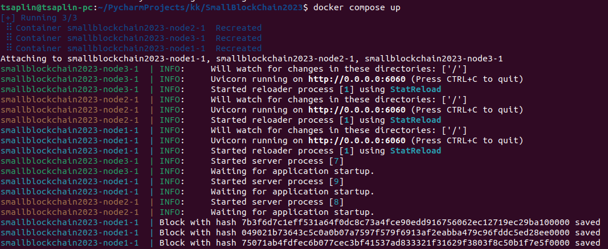

# SmallBlockChain2023

## Описание
Blockchain на Python, разработанный в рамках курса Разработки сетевых приложений, 2023 год.  
Сетевое взаимодействие через сервера FastApi.


## Запуск проекта
Для запуска проекта требуется выполнить следующие команды:

```git clone https://github.com/TsaplinIA/SmallBlockChain2023.git```   
```cd SmallBlockChain2023```  
```docker compose build```  
```docker-compose up```  

## Демонстрация работы

Демонстрация работы проекта с использованием ```docker-compose```:



Стоит отметить, что взаимодействие между нодами идёт через обращение по именам docker сервисов.
